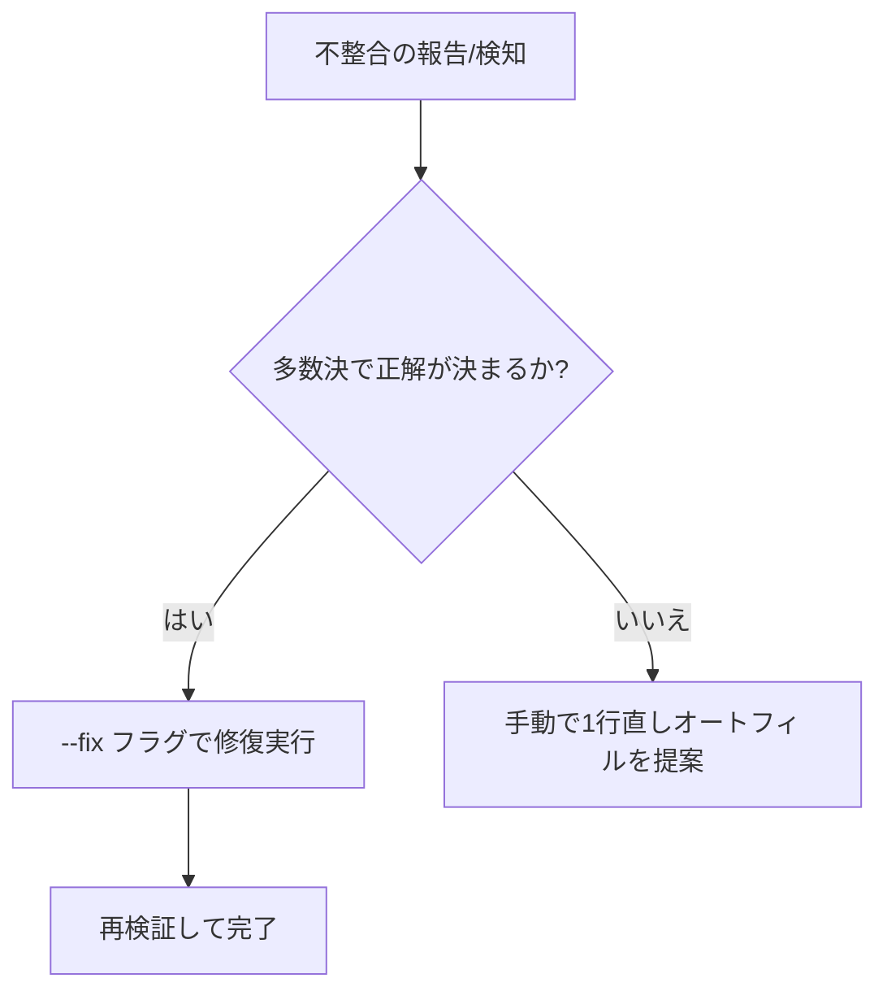

# 自己修復バリデーター (Self-Healing Validator)

## 概要
Excel WBS の数式破損（数値上書き、参照ミス）を、シート内の一貫性（多数決パターン）に基づいて外科的に修復する。

## いつ使用するか
- ユーザーが「エクセルが壊れた」「計算がおかしい」と報告した。
- `scripts/check_wbs.sh` で「数式の不整合」が検知された。
- AI が整合性チェックを行い、多数の行で共通の数式パターンがあるが、特定の行だけが異なっていることを発見した。



## コアパターン
このバリデーターは **「現在のシート内で最も多い数式パターン」** を SSOT とみなす動的学習型である。

| 状態 | アクション |
| --- | --- |
| 数式が数値に上書きされている | 多数派の数式テンプレートを再注入 |
| 1行だけ計算ロジックが違う | 多数派のロジックに合わせる |
| 多数決がタイ（同数） | 安全のため修復をスキップ |

## 実装コマンド
### 検知と修復
```bash
# 1. まず検知する
./scripts/check_wbs.sh [ファイルパス]

# 2. 不整合があれば修復する (バックアップが自動生成される)
./scripts/check_wbs.sh [ファイルパス] --fix
```

## よくある間違い
- **正当化**: 「手動で1つずつ直せばいい」
  - **現実**: 手動はミスを招く。多数決ロジックによる一貫性保持が最も安全。
- **正当化**: 「全ての行を1行目のコピーにすればいい」
  - **現実**: 1行目が壊れている可能性がある。多数決（Majority Vote）こそが SSOT である。

## 注意事項
- **閾値**: 正解パターンは「出現数2以上」かつ「多数派」である必要がある。
- **絶対参照**: `$A$1` などの行固定参照は、抽象化されずにそのまま維持される。
