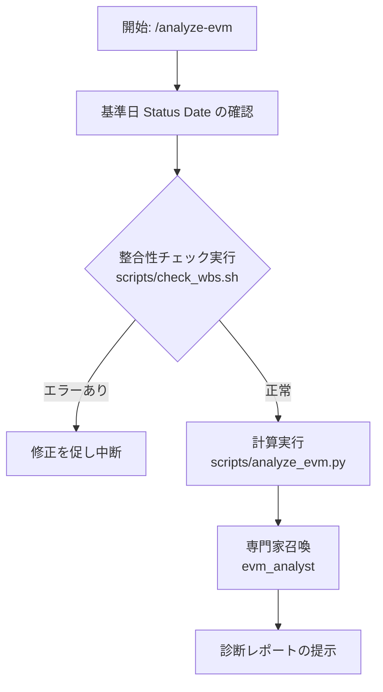

# /analyze-evm スキル

## 概要
WBSデータ（Excel）から正確なEVM指標（PV, EV, AC, CPI, SPI）を算出し、プロジェクトの現状診断と将来予測を行う一連のプロセスを自動化・規律化します。

## ワークフロー (思考プロセス)

## 運用規律 (必須手順)

1. **基準日の確定**: 
   分析を行う基準日（Status Date）をユーザーに確認、または過去の実績日から特定してください。指定がない場合は「本日」をデフォルトとします。
2. **分析前の整合性チェック (絶対義務)**: 
   計算を行う前に必ず `scripts/check_wbs.sh` を実行してください。プロジェクト憲法に従い、不整合なデータに基づく分析を回避します。
3. **正確な計算エンジンの利用**: 
   手動計算やAIによる推測を行わず、必ず `scripts/analyze_evm.py` を実行して数値を算出してください。この結果を Excel にも反映させます。
4. **PMBOK専門家による解釈**: 
   計算結果が得られたら、必ず `@evm_analyst` を召喚（またはそのペルソナを適用）し、数値をPMBOKの理論に基づいて解釈したレポートを生成してください。

## AIアナリスト・レポートの構成案
- **現状サマリー**: CPI, SPI の値と「信号（青/黄/赤）」による直感的な提示。
- **将来予測 (EAC)**: このままの効率で進んだ場合の完成予定日とコストの着地点。
- **ボトルネック特定**: 効率を下げている特定のタスクや担当者の特定。
- **是正勧告**: クラッシング、ファスト・トラッキング等の具体的なアクション案。

## クイックリファレンス
- 実行コマンド例: `python scripts/analyze_evm.py projects/test_project/hoge_wbs_evm.xlsx --date 2026-04-03`
- 専門家呼び出し: `@evm_analyst スクリプトの出力を元に、リスク診断をして。`
